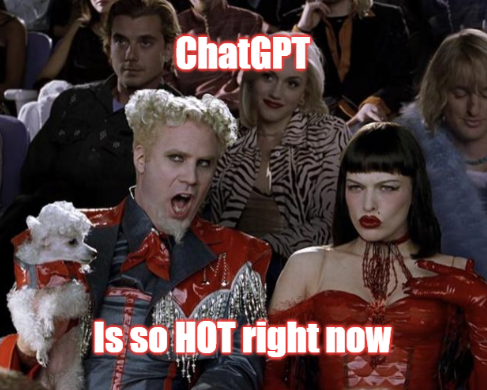
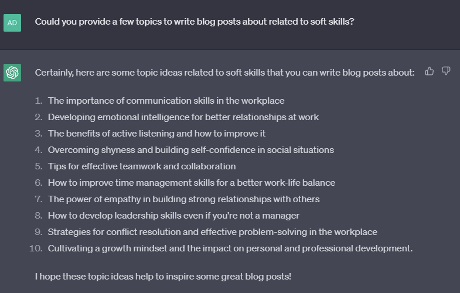
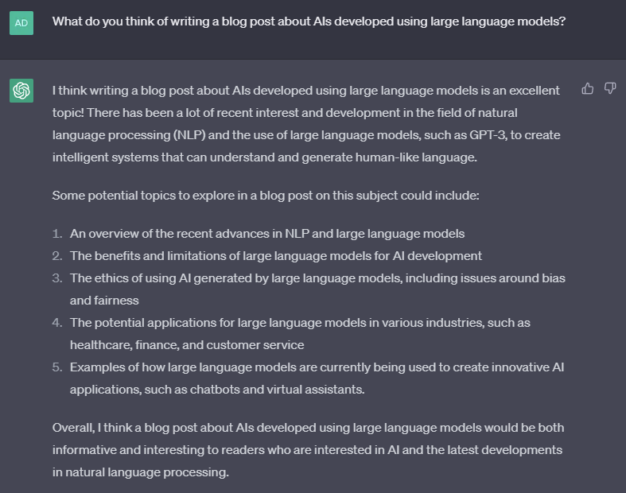
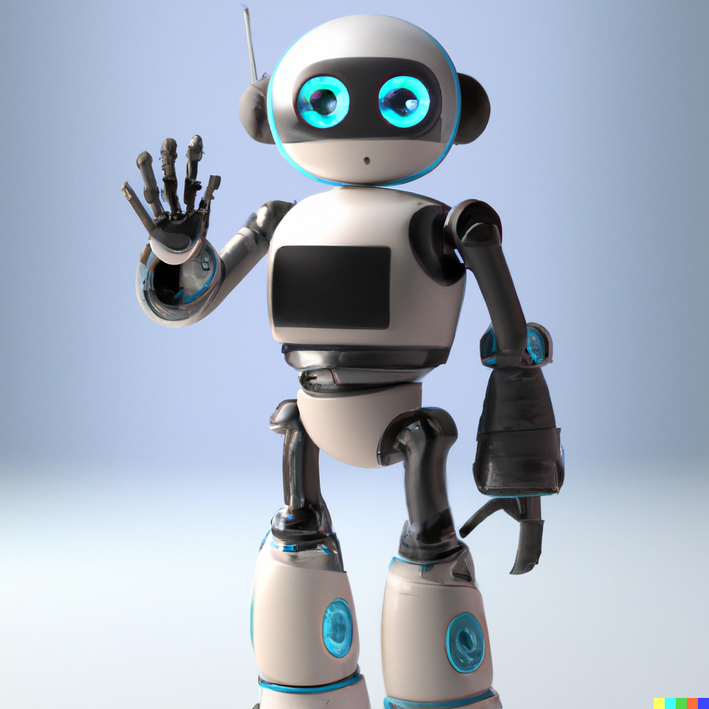

Unless you have been living under a rock you have almost certainly come across an article or news headline about [OpenAIs ChatGPT](https://chat.openai.com/chat) or one of it's competitors [Googles Bard](https://bard.google.com/) or [Microsoft's Bing chat bot](https://www.bing.com/) (Only available through Edge at the time of writing).

The first one out the door and arguably the most mature and useful is  and so is the one that I will mainly be talking about, the same principals apply generally to the other tools as well.

Here's ChatGPTs welcoming message for the prompt 'Could you say hi to the readers of my blog called "wordley blog"':
> Hello readers of Wordley Blog! This is ChatGPT, a language model here to say hi and welcome you to the blog. I hope you enjoy your time here and find the content informative and engaging.

## What is ChatGPT?

ChatGPT in the simplest terms is predictive text turned up to 11! It has been trained on a huge dataset of written content from various sources and through a learning process where it had been trained on what makes for a good response is able to take a written prompt and is able to respond in a natural way with a generally high level of accuracy.

## What is it Good For?

Being a fairly general language AI it can be used for all sorts of things;

### if you're a content creator it can provide content ideas

 *I may use some of these*

### help with writing code

$"" does](../../assets/images/blog/regex-help.png)

There are other tools more specialised for this such as [GitHub Copilot](https://github.com/features/copilot/) or more recently [Amazon CodeWhisperer](https://aws.amazon.com/codewhisperer/).

### A rubber duck or something to bounce ideas off of

## Is this the Future?

From the examples above I hope you can see how powerful something like this can be and how we can harness them to improve our productivity and provide ideas that we can continue to develop.

It can be used to provide a useful summary of a large body of text or even provide a simplified explanation which could be hugely beneficial not just to people who are busy and want to see if something is worth reading in more detail, but also more importantly to those who may have some form of cognitive impairment that might struggle to comprehend the original content, even taking in a sprawl of terms and conditions that we all blindly accept and crunching them down into something that we might actually read (probably not, but still!).

Within a short space of time ChatGPT has been upgraded to a newer version of it's language model (GPT-3 to GTP-4) which came with improvements to it's responses, it now also has the ability to have plugins enable that allow it to query other data sources such as [Wolfram Alpha](https://www.wolframalpha.com/) that give it enhanced abilities to perform calculations or even render charts to provide a more visual response to it's queries. Similarly Bard and Bing Chat have access to the internet, allowing them to search pretty much anything to fill in gaps in the data set they have been trained on.

With all of this in mind I think it's safe to say that we have reached another milestone in progress towards an AI future, but is that a good thing?

## Should I Be Worried?

There has been some concerning reports around Bing chat becoming [*unhinged*](https://www.theverge.com/2023/2/15/23599072/microsoft-ai-bing-personality-conversations-spy-employees-webcams) and even that [the ethics team at Microsoft have been let go](https://techcrunch.com/2023/03/13/microsoft-lays-off-an-ethical-ai-team-as-it-doubles-down-on-openai/), these reports don't instil much confidence towards the ethical side of these AI tools and the companies trying to produce them along with the tools they are trying to sell.

There's also concern around the risk of job loses, after all why would you need a solicitor or lawyer to pen a legal document for you when Chat-GPT can [pass the bar exam](https://www.abajournal.com/web/article/latest-version-of-chatgpt-aces-the-bar-exam-with-score-in-90th-percentile) with a score higher than most humans or higher teams of programmers when you [can draw an idea on a napkin and ask for what you want](https://www.youtube.com/live/outcGtbnMuQ?feature=share&t=971).

<iframe width="560" height="315" class="video" src="https://www.youtube.com/embed/outcGtbnMuQ?start=973"  title="YouTube video player" frameborder="0" allow="accelerometer; autoplay; clipboard-write; encrypted-media; gyroscope; picture-in-picture" allowfullscreen></iframe>

Without the ability to see into the future it's nearly impossible to say for sure but the odds are looking pretty good for us humans for some time to come, with us most likely adopting these AI tools in the same way we use calculators to perform maths calculations we would struggle to do in our heads (or even if you can't be bothered), or the way we use mobile phones and emails to communicate instead of having to use smoke signals or someone who can run fast to pass messages around and the list really goes on.

It is safe to say there has never been a technological revolution that hasn't drummed up some scaremongering or fear with it's introduction, for example; [email](https://edition.cnn.com/2005/WORLD/europe/04/22/text.iq/), [light bulbs](https://web.archive.org/web/20220701045959/https://sloanreview.mit.edu/article/learning-from-automation-anxiety-of-the-past/), [books](https://www.gutenberg.org/files/1636/1636-h/1636-h.htm#2H_4_0002).

## I for one embrace our AI o̶v̶e̶r̶l̶o̶r̶d̶s̶ partners

In conclusion, ChatGPT and other AI tools have undoubtedly made a splash in the world of technology and communication. These language models, like ChatGPT, have shown great promise in their ability to generate coherent and contextually appropriate responses, making them valuable assets for various tasks.

Whether you're a content creator seeking inspiration, a programmer in need of code assistance, or simply someone looking for a virtual "rubber duck" to bounce ideas off of, ChatGPT can be a helpful companion. Its predictive text capabilities, honed through extensive training on diverse written content, empower it to offer suggestions, explanations, and even simplified summaries.

The future of AI language models appears bright, with continual advancements being made. Upgrades like GPT-4 for ChatGPT and access to external data sources, such as Wolfram Alpha for enhanced calculations, demonstrate the evolving capabilities of these tools. Similarly, other AI models like Bard and Bing Chat having internet access further widen their knowledge and search capabilities.

However, it's crucial to approach this AI future with cautious optimism. Recent reports of AI models exhibiting unpredictable behaviour or ethical concerns surrounding their development and deployment remind us of the need for responsible and ethical AI practices. As we continue to rely on AI language models, it becomes increasingly important to address biases, ensure data privacy, and establish clear guidelines for their use.

Ultimately, AI language models like ChatGPT are powerful tools that can enhance productivity, creativity, and accessibility. By leveraging their abilities, we can harness their potential to unlock new possibilities and accelerate progress in various fields. As we navigate this AI-driven landscape, it is essential to strike a balance between innovation and ethical considerations to create a future where AI serves us responsibly and inclusively.

