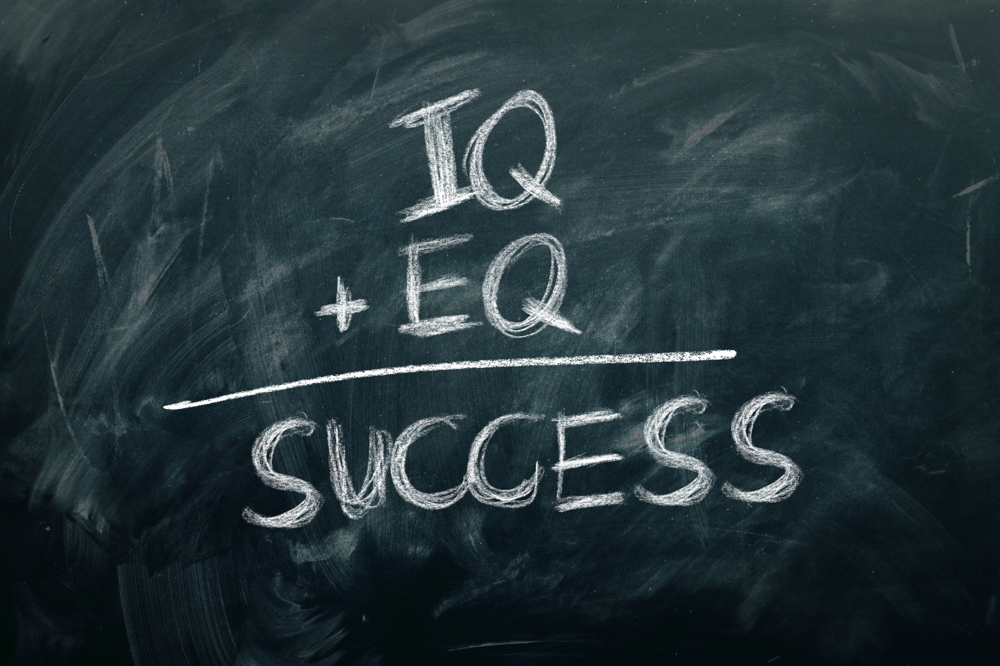

In the world of intelligence, there are two terms that often spark lively discussions: IQ (Intelligence Quotient) and the less talked about EQ (Emotional Quotient). While IQ has been the traditional measure of smarts, EQ has emerged as a game-changer, revolutionizing how we understand success and happiness. In this blog post, we'll dive into the differences between EQ and IQ, explore their unique strengths, and discover why EQ is becoming a key player in personal and professional growth.

## Understanding IQ

IQ, or Intelligence Quotient, focuses on cognitive intelligence. It measures intellectual abilities like logical thinking, problem-solving, memory, and language skills (I have no doubt that you've seen some kind of advert or post about an IQ test or someone bragging about their results from *trustworthy* website). IQ tests assess analytical skills, giving a score that compares intellectual capabilities against others, with a higher score being better, for example an IQ of over 130 would put someone in the top 2% of the population. For a long time, IQ was considered the golden standard to predict academic and job success.

## Exploring EQ

Now, let's turn our attention to EQ, or Emotional Quotient, which deals with emotional intelligence. It's all about perceiving, understanding, managing, and expressing emotions, both in oneself and others. EQ includes skills like empathy, self-awareness, emotional control, communication, and social awareness. Unlike IQ, EQ is a flexible aspect of intelligence that can be nurtured and improved over time. EQ doesn't have the same kind of scoring system as with an IQ and testing is often self reported as it is not as quantifiable as a logic test can be.

## The Power of Emotional Intelligence

While IQ may determine cognitive abilities, it's EQ that often determines how well individuals handle the ups and downs of life. Here's why EQ is gaining recognition as a vital skill:

1. Building Stronger Relationships: Emotional intelligence enhances relationships by helping us understand and empathize with others. People with high EQ can communicate effectively, resolve conflicts, and collaborate, fostering healthier connections and teamwork.

2. Leadership and Influence: Leaders with high EQ inspire and motivate others, creating positive work environments. They can manage their emotions, adapt to change, and make thoughtful decisions that consider their team's well-being.

3. Resilience and Adaptability: Emotional intelligence equips individuals with the tools to manage stress, cope with setbacks, and bounce back from failure. Those with high EQ are better equipped to adapt to change, handle challenges, and maintain a positive outlook in tough times.

4. Effective Communication: EQ helps us become better communicators by understanding non-verbal cues, actively listening, and responding empathetically. This skill is crucial in personal relationships and professional settings such as negotiations, sales, and customer service.

## Striking a Balance

While both EQ and IQ have their merits, finding a balance between the two is key. A high IQ can provide a solid foundation for problem-solving and critical thinking, while EQ enhances interpersonal skills and emotional well-being. By nurturing both forms of intelligence, we unlock our true potential and thrive in various aspects of life.

## Conclusion

As our understanding of intelligence evolves, the significance of emotional intelligence, or EQ, becomes clearer. While IQ measures cognitive abilities, EQ encompasses skills that cultivate self-awareness, empathy, resilience, and effective communication. Developing emotional intelligence can positively impact personal relationships, leadership capabilities, and overall well-being. By embracing the power of EQ alongside IQ, we pave the way for a more fulfilling and successful future.

As the saying goes
> "It's not *what* you know, but *who*"

is probably the best representation of this idea, if you have the inter-personal skills and the ability to connect with others you stand a good chance of getting further in work and in life!

###### I couldn't bring myself to use a cheesy stock photo, so here's a bunch of spidermen as a team
