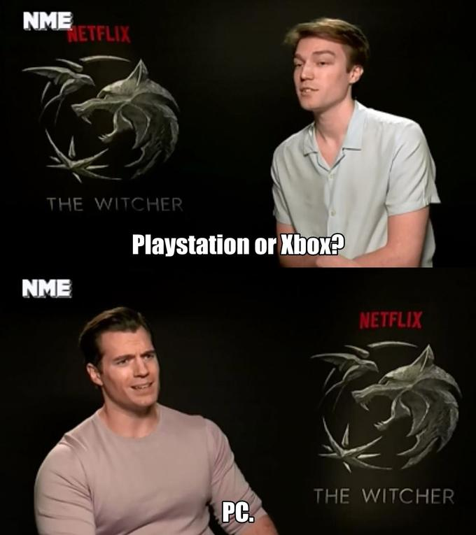

What is a fallacy? Stolen from the best source of information we as a species have managed to create, wikipedia describes a fallacy as

> A fallacy is the use of invalid or otherwise faulty reasoning in the construction of an argument. All forms of human communication can contain fallacies.

Or to put it more simply fallacies are traps that we fall for because our brains like to simplify things and protect itself and our feelings, we've all fallen for them and we will continue to fall for them in the same way we crave junk foods.

This is going to be a relatively short post about a few of the most common fallacies you might come across and I can almost guarantee that I have myself fallen into one of them in the process of writing this blog post.

## Sunk cost fallacy

You know that situation when you're watching a film or reading a book and you get about half way and realise that you're really not enjoying it, but you end up forcing yourself into finishing it? That's the sunk cost fallacy in a nut-shell.

It's when you have the feeling that you have already expended some amount of energy or resources into something, be it an activity like previously mentioned, but it can also be monetary investment, think of being in a casino and going 'double or nothing', or potentially even in investing in shares.

When you find yourself in an un-comfortable position like this it's a good idea to take a step back an really asses your situation; is it really worth you time finishing that book you're not enjoying when you could be finding another that you really do enjoy? Is it really such a good idea to bet all that you have left in an attempt to re-coup your losses?

In many situations the answer is 'no', but we feel that we have already invested enough of our resources into whatever it may be so _surely we must continue_. If you find yourself in this situation I find it can be useful to ask someone else who isn't invested for their opinion as they can provide a sanity check and reasoning that might be able to talk you out of it.

## Appeal to nature

This is quite a simple one and it's the concept that whatever is _natural_ must be _good_ vs artificial or manufactured goods. Hank Green recently posted a video touching on this subject around 'natural' cancer treatments that you can watch here...

<iframe width="560" height="315" class="video" src="https://www.youtube.com/embed/mJcjefKUOcc?si=MztehuplYOdpQ9Dc" title="YouTube video player" frameborder="0" allow="accelerometer; autoplay; clipboard-write; encrypted-media; gyroscope; picture-in-picture; web-share" allowfullscreen></iframe>

Effectively just because something is natural doesn't inherently make it _good_ or _better_ for you compared to a processed alternative - I'm not saying that's always true but ultimately 'the dose makes the poison'.

## Appeal to tradition

The idea of the appealing to tradition can be relatively well summed up with the saying: "if it ain't broke don't fix it", I can quite comfortably say that we wouldn't have gotten very far as a species if we applied this logic all the time. I would agree that constantly gunning for new or different ways of doing things isn't a great idea either (more on this later) but without our curiosity and laziness we would never have created most of the things we use every day.

## Appeal to novelty

I think I'll let Barney from "how i met you mother" explain this one...

<iframe width="560" height="315" class="video" src="https://www.youtube.com/embed/1SNRULEnTVQ?si=Kcl8ha_nHY8OHwRl&amp;start=36" title="YouTube video player" frameborder="0" allow="accelerometer; autoplay; clipboard-write; encrypted-media; gyroscope; picture-in-picture; web-share" allowfullscreen></iframe>

If you didn't want to watch the video or prefer me trying to explain things, then the idea is that because something is new must mean it's better than something that is old. This is a fallacy again, not because newer things are never better but because it's an over simplification to assume that it would be the case.

It's perfectly fine to enjoy trying out something new and shiny, it tends to light up that _fun_ part of our brains, but when it comes to long term decisions this one can really come back to bite you. It would be my advise to try new things but avoid committing too early on the things that really matter or can't be easily changed.

## False dilemma fallacy

This fallacy is when you are presented (or are presenting) a situation with usually only two options when there are other options available, or in other words given a black and white option when there's 50 shades of grey between. For example someone gives you the question of which is better Playstation or Xbox...

This is something that I come across often, mostly because my wife enjoys asking my impossible questions in increasingly bizarre and unlikely situations that usually involves saving someone or one of our dogs from some kind of burning building or cliff.

The issue with this fallacy is that the options are presented or interpreted as being mutually exclusive when there is actually an option in between or another alternative available.

## Wrapping things up

I have barely scratched the surface of the kinds of fallacies or pitfalls we often find ourselves falling into but I hope that you have at least learned of one that you didn't know of, or at least provided a name to one that you already instinctively knew of.

It would be interesting to hear of the other fallacies that you're most familiar with or find most useful to know of and I will likely make a follow up post with more in the future, but for now I think we'll call it a day.